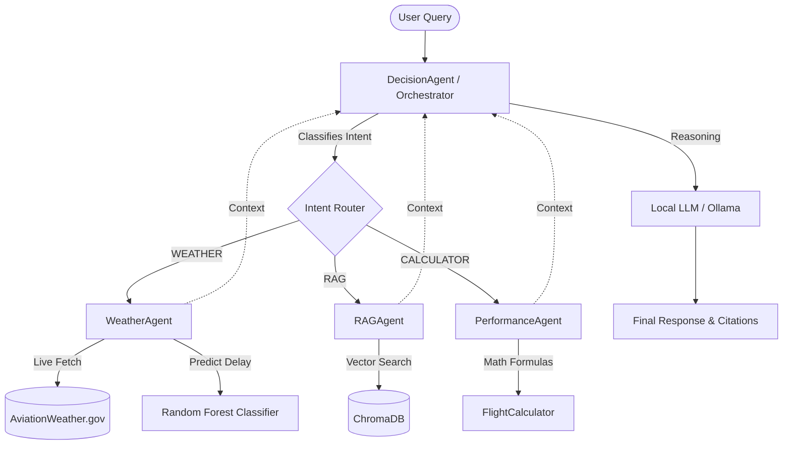

# Multi-Agent Flight Operations CoPilot Dashboard

An airline-grade intelligent flight operations assistant and dashboard. Powered by a cooperative multi-agent system, the CoPilot processes real-time weather reports, parses en-route hazards, indexes flight manuals via RAG, and runs mathematical performance calculations.

## 🛠️ System Architecture

The project leverages a **cooperative multi-agent workflow** to route user queries:



1. **`DecisionAgent`**: Classifies query intent and acts as the orchestrator. It queries specialists, structures recommendations, and highlights warnings.
2. **`WeatherAgent`**: Extracts/fetches METAR, TAF, and SIGMET reports. Evaluates delay risk using a trained Random Forest model.
3. **`RAGAgent`**: Queries indexed manuals (PDFs) or performs exact metadata lookups for airport identifiers.
4. **`PerformanceAgent`**: Computes mathematical equations (e.g. landing distance, fuel burn rate).

---

## ✨ Key Features

* **Real-time Meteorological Fetching**: Pulls live METARs from the official AviationWeather.gov API.
* **Forecast & En-Route Hazard Decoding**:
  * **TAF Forecasts**: Scans `FM`, `TEMPO`, and `BECMG` forecast periods to extract worst-case wind gusts, lowest visibility, and ceilings.
  * **SIGMET Advisories**: Triggers warnings for Severe Turbulence (`SEV TURB`), Severe Icing (`SEV ICE`), and Volcanic Ash (`VA`).
* **Runway Markings & Crosswind Warnings**: Downloads and parses the OurAirports runway dataset to map runway alignments and headings for over 85,000 international (e.g. `VO`-prefixed) and domestic airports.
* **Braking Action Grounding**: Clarifies the physical meaning of Runway Visual Range (RVR), separating visibility metrics from braking friction.
* **Severe Icing Alerts**: Automatically flags freezing precipitation/fog under sub-zero temperatures.
* **Premium GUI Dashboard**: Responsive glassmorphism dark-mode UI running on a lightweight python-native socket server.

---

## 🚀 Setup and Installation

### Prerequisites
* Python 3.8+
* [Ollama](https://ollama.com/) running a local model (default: `mistral` or configured in `main.py`).

### 1. Clone & Configure
```bash
git clone https://github.com/BeU2177/flight-ops-copilot.git
cd flight-ops-copilot
```

### 2. Setup Virtual Environment & Install Dependencies
```bash
python -m venv venv
venv\Scripts\activate      # On Windows
source venv/bin/activate    # On macOS/Linux

pip install -r requirements.txt
```

### 3. Place Data Manuals
Place any flight crew manuals (`.pdf` files) and the airport dataset in the `./data` folder:
* `data/airports.csv`
* `data/weatherHistory.csv`
* `data/*.pdf` (e.g., aircraft manuals)

### 4. Run the Web Dashboard GUI
```bash
python server.py
```
Open your browser and navigate to: **[http://localhost:8000/](http://localhost:8000/)**

### 5. Run the CLI Console
```bash
python main.py
```
